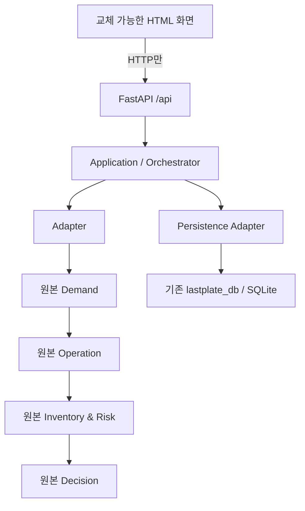

# LastPlate MVP 완료 보고서

검증일: 2026-09-18 KST. 판정: **BACKEND SKELETON READY** — 로컬 MVP 및 발표 데모 기준.

기존 테스트 996개와 새 API/경계 테스트 33개, 총 **1,029개 통과**. 추가 unittest subtest 66개도 통과했습니다(JUnit XML 합계 1,095건). 실제 Edge 브라우저 E2E는 API mock 없이 완료했고 console/page error는 0건입니다.

## A. 기존 Backend / Agent 테스트 결과

처음에는 실행 환경에 fastapi/httpx가 없어 테스트 수집 오류가 났습니다. 격리된 작업 가상환경에 의존성을 설치한 뒤, 코드 변경 전에 기존 suite를 실제 실행했습니다. DB는 첫 실행부터 250개 통과했습니다.

| 대상 | 기존 실행 | 최종 회귀 |
|---|---:|---:|
| 첨부 backend-only v0.2.0 |31 통과 (+12 subtest)|31 통과 (+12)|
| 첨부 integrated-20260917-195151 |19 통과 (+3)|19 통과 (+3)|
| Demand ML |73 통과|73 통과|
| Operation |180 통과|180 통과|
| Inventory & Risk |240 통과|240 통과|
| Decision |163 통과 (+51)|163 통과 (+51)|
| Native Integration / FastAPI |40 통과|40 통과|
| SQLite v0.3.0 |250 통과|250 통과|

새 Public API 24개와 경계/업로드/저장 회귀 9개도 통과했습니다. 증빙: [최종 회귀 요약](../reports/regression/summary.json), 각 suite의 XML과 txt 로그.

첨부된 ‘통합본’ ZIP 자체에는 네 Agent 전체 구현이 없었습니다. backend-only의 감사 목록이 참조하는 `lastplate-integrated-v0.1.2.zip`을 이전 LastPlate 로컬 산출물에서 찾았고, **감사 해시 633개가 모두 일치**한 원본을 사용했습니다. 사용한 원본 출처는 `reports/source-provenance.json`에 기록했습니다. 원본 파일들은 새 배포본의 `vendor/native/`에 그대로 포함했습니다. [Native 보존 해시](../reports/native-preservation.json), [DB 모듈 보존 해시](../reports/persistence-preservation.json).

통합 후 재검사에서 추가로 발견한 두 문제도 해결했습니다.

- 이전 두 백엔드 저장소의 최신 계획 조회가 `created_at`만 정렬하여 생성 시각이 같으면 이전 행을 반환할 수 있었습니다. repository 두 곳에 `rowid DESC` 보조 정렬만 추가했습니다. 시간을 동일하게 고정한 재현 테스트 2개가 통과합니다. 최초 실패 로그도 `reports/legacy-ui-timestamp-failure.*`에 보관했습니다.
- DB 테스트를 `tests/persistence`로 이동하면서 한 subprocess 테스트의 module 검색 경로가 달라졌습니다. 테스트 환경의 PYTHONPATH를 프로젝트 루트로 지정했고, DB 원본 코드/테스트 내용을 바꾸지 않고 250개를 다시 통과했습니다.

## B. 기존 UI가 깨진 원인

제공 코드에서 확인한 계약 불일치는 다음과 같습니다. 사용자가 겪은 당시 브라우저 로그가 없으므로 과거 모든 장애의 원인이라고 단정하지는 않습니다.

| 경계 | 이전 UI/Backend | 전체 Agent 통합본 |
|---|---|---|
| endpoint |`/api/v1/forecasts/predict`, `/api/v1/operation-plans`|`/api/plan`|
| 날짜 |meal_date / current_time|target_date / as_of|
| 예측 |forecast.lower / mid / upper|demand.predicted_diners / nullable bounds|
| 계획 |result.target / menus / inventory|operation.recommended_servings / ingredient_requirements|
| 단위 |kg 중심, UI에서 recipe 합산|g/kg 입력, native 수량 의미/증빙|
| 완료 상태 |별도 review_allowed/reviewed_demo|COMPLETE/PARTIAL와 Decision 승인 게이트|
| 이벤트 |이전 batch 엔진 증감|Risk parser의 재검증 요청; 자동 downstream 실행 없음|

이전 UI는 일부 식재료 기준량과 차이를 JS에서 계산했습니다. 새 UI에서는 해당 로직을 제거했습니다. `DEMO 값이 ML 예측을 덮어쓴다`는 가정으로 모델을 수정하지 않았습니다. 실제 모델의 분포 밖 결과는 H 절처럼 그대로 관찰하고 표시했습니다.

## C. 새 Backend 구조



원본 Agent는 subprocess로 격리해 기존 tools/config/schema 패키지 충돌을 피합니다. 새 application orchestrator는 원본 통합 흐름을 기반으로 했으며, 변경은 transport import, 명시적 인원 이벤트 시나리오, 저장 hook 연결에 한정했습니다. ML 모델/피처·Operation 계산·Risk 판단·Decision 정책은 재작성하지 않았습니다.

## D. 확정 API Contract

[API-CONTRACT.md](API-CONTRACT.md), [OpenAPI JSON](openapi.json), `backend/contracts.py`가 기준입니다.

- `pipeline_status`: SUCCESS / PARTIAL / FAILED. 원본 COMPLETE를 SUCCESS로 매핑.
- `persistence_status`: SUCCESS / PARTIAL / FAILED. 계산 상태와 분리.
- `request_id`, `parent_request_id`, `persistence_ids`: 서버 생성/연결.
- `demand`, `operation`, `inventory_risk`, `decision`: 실제 Agent 결과를 mapping하고 원본 증빙을 유지.
- 점 예측의 lower/upper/predicted_rate는 null. confidence는 원본 UNKNOWN/LOW를 보존.
- `constraints`는 원본 object, `recommended_rechecks`는 원본 문자열/객체 목록으로 유지.
- safety_margin_pct=3은 safety_margin=0.03으로 명시적 단위 변환.
- Decision의 recommended_servings=null을 Operation 값으로 채우지 않음.
- 이벤트는 전체 목록을 대체하며 반복 재계획에서도 중복 가산하지 않음.

## E. Endpoint 목록

| Method | Endpoint | 동작 |
|---|---|---|
|GET|/api/health|status=ok|
|GET|/api/demo-profile|LH-like / small-site / risk-demo|
|POST|/api/plan|네 Agent 전체 실행|
|POST|/api/replan|저장 context + 현재 이벤트로 전체 재실행|
|GET|/api/plans/{request_id}|저장된 계획 결과|
|POST|/api/upload/menu|CSV/XLSX 식단 검증|
|POST|/api/upload/inventory|CSV/XLSX 재고 검증·snapshot 저장|
|POST|/api/actual-results|실측 운영 결과 저장·재조회|
|GET|/api/history/{site_id}|최근 실적과 당시 예측/계획|
|GET|/api/kpis/{site_id}|오차·폐기·부족·학습 준비 건수|
|GET|/api/learning-dataset/{site_id}|검증된 학습 dataset 추출|
|POST|/api/plans/{request_id}/acknowledgement|읽음 확인; 승인 아님|

## F. Frontend 화면 구조

1. **운영 계획**: 사업장/날짜/인사 입력, 식단·재고 업로드, planned order, 이벤트, 네 Agent 카드, OOD, 출처, 확인 버튼.
2. **운영 결과 입력**: 실제 식수/조리량/잔식/잔반/식재료 폐기/부족/비고, 저장 결과, 절대 예측오차, 초과 조리량, 이력, 전체/검증 데이터 건수.

HTTP 호출은 `frontend/api/lastplateApi.js`, 표현은 `components/cards.js`, 스타일은 `styles/main.css`로 분리했습니다. 숫자 formatting과 입력 직렬화만 프론트에 있고 business 계산식은 없습니다. [계획 화면](../reports/browser-plan.png), [실적 화면](../reports/browser-actual.png), [OOD 화면](../reports/browser-ood.png).

## G. E2E 실행 결과

| Case | 검증 | 결과 |
|---:|---|---|
|1|LH-like 정상 input|SUCCESS|
|2|600명|OOD 경고 유지|
|3|5000명|OOD 경고 유지|
|4|인원 +80 이벤트|raw ML 유지, Operation 기준·권장량 증가, 반복 가산 없음|
|5|재고 부족|Risk shortage / Decision BLOCK|
|6|유통기한 임박|expiry_risk 및 후속 권고|
|7|가격 상승|price_risks / 대체 후보 / Decision 후보 검토|
|8|영양 Hard Constraint FAIL|Operation FAIL / Decision BLOCK|
|9|레시피 누락|422 PARTIAL, Demand 유지, NEEDS_CONFIRMATION|
|10|미지원 단위|422 UNIT_ERROR|
|11|해제·superseded 이벤트|이력 유지, 현재 제한 조건에 반영하지 않음|
|12|실적 저장|SQLite 행 생성 후 재조회|
|13|Backend 재시작|같은 result_id/prediction_id 유지|
|14|JSON 직렬화|allow_nan=False 통과|

실제 Edge 153.0.4234.32 브라우저에서 앱 접속→사업장 입력→파일 업로드→계획→네 결과 카드→이벤트 재계획→읽음 확인→실측 입력→저장→조회까지 수행했습니다. 예측 **1111명**은 그대로 유지되고, +80명 이벤트 뒤 조리 권장량은 **1145→1227식**으로 변경됐습니다. 실제 입력 1100명/1300식에 대해 서버가 절대 오차 11명, 초과 조리량 200식을 반환했습니다.

서버 종료 시 포트가 닫힌 것을 확인한 뒤 다른 PID(28476→19500)의 새 서버로 동일 DB를 조회했습니다. 최초 자동화의 종료 확인이 불충분한 부분을 발견해 이 방식으로 강화하여 다시 실행했습니다. 최종 `consoleErrors=[]`, `errors=[]`. [브라우저 실행 증빙](../reports/browser-e2e.json), [서버 로그](../reports/browser-server.log).

## H. OOD 검증

2026-09-21 / 두부조림 / 휴가30·출장50·재택10·초과근무50의 실제 추론 결과입니다. [전체 증빙](../reports/final-ood-evidence.json).

| 재직 인원 | 가용 인원 | 실제 모델 예측 | applicability | 용량 | 조리 권장 |
|---:|---:|---:|---|---:|---:|
|3000|2910|1208|IN_RANGE|2000|1245|
|600|510|1165|OUT_OF_DISTRIBUTION|550|1200|
|5000|4910|1207|OUT_OF_DISTRIBUTION|550|1244|

600명 사업장에 1165명이라는 비현실적인 값이 나오는 현상을 숨기거나 DEMO 수치로 교체하지 않았습니다. capacity로 clip하지 않았으며 Decision은 확인 필요 상태입니다. 직원 수 학습 범위 2601~3305는 실제 training CSV의 hash/행수/기간을 원본 adapter가 확인한 뒤 계산합니다. IN_RANGE는 사업장 일반화 성능이나 calibrated confidence의 보증이 아닙니다. 모델 버전은 `v20260917T054002-4222a35a`입니다.

## I. SQLite 저장 검증

제공된 `lastplate_db` v0.3.0을 그대로 사용합니다. 기본 영구 운영 DB는 `data/lastplate.db` 하나이며 기존 파일은 LASTPLATE_DB_PATH로 지정할 수 있습니다.

Demand 완료 시 predictions, Operation 완료 시 operation_plans, Decision 완료 시 decision_logs, 재고 업로드 시 inventory_snapshots, 운영 실적 입력 시 actual_results를 저장합니다. 기존 helpers를 사용하며 decision log의 recommendation_json에는 prediction_id와 operation_plan_id를 함께 보관합니다.

원본 Demand의 별도 schema를 가진 내부 receipt DB는 요청별 임시 폴더에서만 사용 후 삭제합니다. 원본 input/source payload와 OOD/model metadata는 영구 DB로 이관하므로 장기 운영 DB를 중복 관리하지 않습니다. API context와 읽음 확인용 두 테이블만 같은 DB에 추가합니다.

저장 실패를 주입한 테스트에서 계산은 SUCCESS를 유지했고 persistence warning을 반환했습니다. 실적 endpoint에서는 SQLite/권한 실패를 503 PERSISTENCE_FAILED로 반환합니다.

## J. 실제 운영 결과 입력 검증

화면에서 사용자가 직접 입력한 수치를 저장합니다. 생성 후 repository로 다시 조회한 record를 반환합니다. 동일 입력 재전송은 같은 result_id이며, 동일 site/date의 다른 값은 409입니다. 실적 수정으로 과거 기록을 조용히 덮어쓰지 않습니다.

History는 **실적 입력 이전의 마지막 prediction/operation**과 연결합니다. 실적 이후의 재예측을 오차 평가에 끼워 넣지 않는 경계 테스트도 통과했습니다. 저장된 원본 입력과 model_version을 함께 조회할 수 있습니다.

## K. DEMO / REAL 구분

- 모델의 계산 출처는 MODEL. 샘플 레시피·영양·가격·위험·재고는 DEMO.
- 업로드 출처는 USER_UPLOAD이며, 시연 사업장의 업로드는 is_demo=true를 유지.
- 조회 출처 DATABASE와 원 record의 DEMO 여부를 별도로 보존.
- 연결되지 않은 외부 API를 REAL이라고 표시하지 않음.
- 서버 demo 모드에서 is_demo=false로 재분류하려 하면 409.
- 서로 다른 demo/real 사업장은 site_id를 분리하도록 강제.
- 새 실제 입력도 UNVALIDATED로 저장. 안전한 학습/KPI helper는 DEMO/미검증을 제외.

화면의 ‘전체 입력 1, 검증된 실제 입력 0’은 정상입니다. 0인 평균을 만들어 내지 않고 KPI는 null/insufficient_data로 반환합니다. 30건 임계치는 검토 준비 기준이며 모델 재학습이나 성능 개선을 의미하지 않습니다.

## L. Human Approval 검증

모든 native Decision의 requires_human_approval=true와 pending/blocked 상태를 유지했습니다. ‘확인했습니다’는 별도 읽음 기록이며 DB decision.approved는 false입니다. 발주, 재고 차감, 메뉴 변경, 승인 게이트 해제, 재학습을 실행하는 endpoint가 없습니다.

## M. 남은 P0

검증한 **로컬 MVP 뼈대와 DEMO 흐름 범위에는 알려진 차단 P0가 없습니다.** 네 Agent 내부 정책을 우회하지 않고도 전체 흐름이 실행되며 실적이 저장됩니다. production 운영 승인 시스템의 완성을 의미하지는 않습니다.

## N. 남은 P1

1. 실제 사업장의 검증 데이터·인사정보 확보 증빙·레시피/영양/가격/공급 provider 연결. 현재 샘플로 운영 가능성을 과장하지 않습니다.
2. 운영 데이터의 관리자 검증/정정 UI. 원본 DB의 audit 기능은 보존했지만 이번 화면은 신규 기록과 읽음 확인까지입니다.
3. 일부 자연어 문장(예: ‘외부 방문객’)에 대해 원본 parser가 수량을 읽어도 잔여 구문을 partial로 남깁니다. 인원 시나리오는 표시하되 확인 게이트는 유지합니다. 데모 권장 입력은 ‘내일 손님 80명 추가’입니다.
4. 원본 Decision의 재검증 상태를 증빙 기반으로 완료 처리하는 정식 workflow. 이번 MVP는 재계산을 실행하지만 기존 pending gate를 임의로 통과시키지 않습니다.
5. 공유 배포 전 인증/사업장 권한/백업/운영 로그 정책, 대규모 작업의 job queue·progress API. 현재는 로컬 단일 UI 및 동기 pipeline입니다.
6. 사업장 calibration / batch retraining은 Demand 책임으로 별도 실행·평가해야 합니다.
7. Starlette/anyio 테스트 환경 deprecation warning 1종. 기능 실패는 없으며 원본 코드를 불필요하게 바꾸지 않았습니다.

## O. 향후 UI 디자인만 교체하는 방법

공개 JSON을 유지한 채 `index.html`, `styles/main.css`, `components/cards.js`를 교체하세요. API 호출은 `api/lastplateApi.js`에 남깁니다. React/Tailwind/Stitch component도 같은 response를 소비하면 됩니다. preview나 템플릿에서 계산식/Agent import/임의 ID/클라이언트 예측값을 추가하지 않습니다. 별도 host의 UI에는 `/api` reverse proxy를 설정합니다.

## P. 발표용 Demo flow

1. LH-like 프로필 3000명 선택 → MODEL과 DEMO badges 설명.
2. 주간 식단 CSV와 재고 XLSX 업로드 → 재고 snapshot 저장 확인.
3. 계획 생성 → 예측 원값/구간 없음/Operation 필요량/발주 검수/Risk/Decision 확인.
4. ‘내일 손님 80명 추가’ → 재계획 → ML 원값 유지와 운영 수량 변화 비교.
5. Decision 확인 필요 상태와 자동 실행이 없음을 설명 → 읽음 확인.
6. 급식 종료 가정 후 실제 식수·조리량·폐기량 입력 → 저장 → 예측오차와 이력 확인.
7. 재시작 후 기록 유지 → DEMO가 학습용 실데이터 건수에 섞이지 않음을 설명.

샘플 업로드 파일 날짜는 2026-09-19입니다. 발표일에 맞춰 date/expiry_date/운영일을 수정하거나 기본 프로필의 식단·재고를 사용하세요. 샘플 값의 날짜 변경은 DEMO임을 유지하며 실제 과거 관측으로 표시하지 않습니다.

## Q. 실행 명령어

```powershell
python -m venv .venv
.venv\Scripts\Activate.ps1
pip install -r requirements.txt
python run.py
```

http://127.0.0.1:8000 접속. 프론트 별도 실행 불필요.

```powershell
pip install -r requirements-dev.txt
python -m pytest
python scripts/run_tests.py
npm install
npx playwright install chromium
npm run test:browser
```

브라우저 test runner의 `/__e2e_identity`는 검사 서버에만 존재하고 `python run.py`의 공개 app에는 추가되지 않습니다. 원본 Agent 전체 회귀는 몇 분 걸립니다.

## R. 프로젝트 전체 ZIP

`LastPlate-MVP-Skeleton-v1.0.0.zip`에 실행 코드, 네 native Agent/모델/필수 training evidence, 재사용 DB, 프론트, 샘플 파일, 테스트, OpenAPI, 본 보고서, 검증 로그/스크린샷을 포함했습니다. 가상환경, cache, 테스트 DB, 실행 중 데이터는 제외합니다.

ZIP 생성 시 CRC와 native 633개 파일의 SHA-256을 검사합니다. 압축을 새 폴더에 풀어 실제 모델 pipeline과 SQLite 저장이 실행되는지 추가 확인합니다. 패키징 결과는 `reports/release-smoke.json` 및 ZIP 옆 `release-check.json`에 기록합니다.

**최종 판정: BACKEND SKELETON READY.** 판단 근거는 실제 원본/공개 API 테스트, OOD 추론, SQLite 저장·재시작, 브라우저 E2E입니다.
